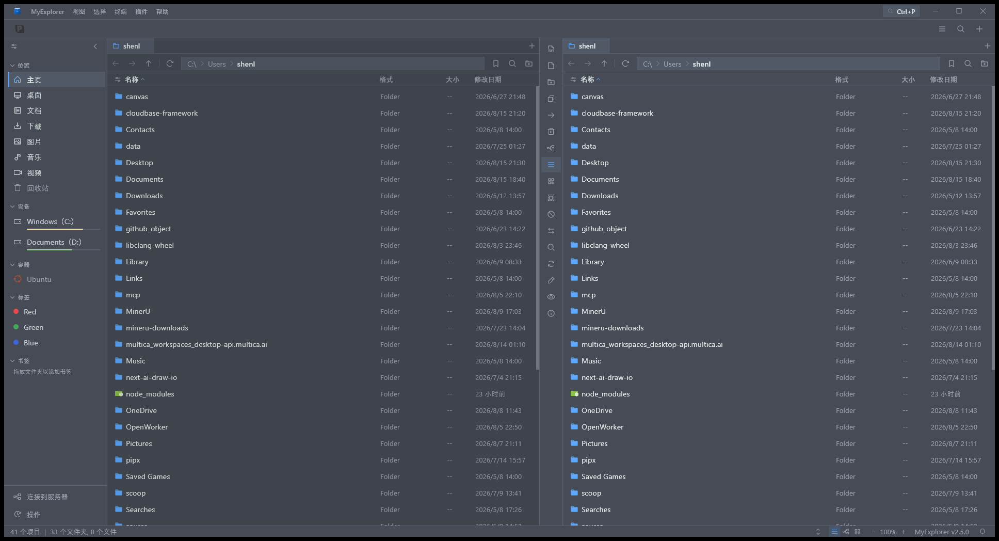

# MyExplorer

A lightweight, self-use Windows file manager similar to Total Commander, forked from [Waydir](https://github.com/Waydir/Waydir).

一个自用的、类似 Total Commander 的 Windows 文件管理器，源自 [Waydir](https://github.com/Waydir/Waydir)。

 

<p align="center">
  
</p>

> **V2.6**: 快捷栏编辑与工程整理 —— 横快捷栏支持**右键编辑/删除**快捷方式，配置对话框可直接修改已有按钮（预填表单 + 保存/取消）；代码审查相关：GBK 编码主题 ini 自动容错、Program Files 只读目录降级、`menus.dart`/`sidebar.dart` 按域拆分、新增 operations/sftp/AppDirs 单测等。
>
> **V2.5**: 代码审查修复 —— 路径穿越防护（archive_reader）、编译错误（operation_store）、插件操作级联（menus.dart）、快捷键绑定错误（keyboard_shortcuts）、数据库过度删除、搜索异常静默失败、git 监听泄漏等 16 项 bug 修复。
>
> **V2.4**: 便携式布局 —— 数据库、日志、主题、插件、更新与缓存全部保存在程序目录内，不写入 `%APPDATA%`/`%TEMP%`；标签行与浅色模式文字精细调整。
>
> **V2.3**: 稳定性与性能 —— 快捷栏保存串行化（快速操作不再丢配置）、文件操作目标校验、Git 状态缓存与更宽容的超时。
>
> **V2.2**: 主题与可用性打磨 —— 深色模式底色 RGB(70,75,85)、文字 RGB(223,233,233)；快捷栏按钮自动从目标 exe 提取图标（支持 `路径,索引`）；标签文件行不再整行着色（保留 badge 圆点）。
>
> **V2.1**: 品牌统一为 **MyExplorer**（全项目由 waydir 更名，含原生核心、插件 API、发布产物）；文件着色改为文件名着色，新增右键 NC 扩展选择模式。
>
> **V2.0**: Total Commander 对标升级完成 —— 双窗格 + 中间竖快捷栏、Ctrl+Q 快速查看、操作队列、校验清单、分割合并、重复文件查找、文件着色、7z 支持、压缩包内编辑等。

---

## 特性一览

### 界面与导航
- **恒双窗格**布局（不可切回单窗格），中间 46px 竖型快捷栏（新建/查看/复制到对面/移动到对面/删除/三视图切换/选择组/反选/搜索/同步/批量重命名/隐藏切换/属性）
- 每窗格多标签、列表/树形/网格三视图、侧边栏（书签/驱动器/树）
- **Ctrl+Q 快速查看面板**：对侧窗格底部常驻预览，随光标实时刷新（图片/PDF/Markdown/代码/属性）
- Quick Look 弹窗（空格）支持代码高亮、图片、Markdown、PDF 预览与**压缩包内文件编辑**

### TC 兼容
- **快捷栏**：导入 Total Commander `.bar` 按钮栏（GBK/UTF-8）、exe/dll 图标提取、`CD` 跳转、`cm_` 内置命令；按钮支持**右键编辑/删除**，配置对话框可添加、编辑、移除、排序
- **参数宏**：`%P` `%N` `%T` `%M` `%L` `%S`（及小写原始值变体）在按钮运行时展开，完全对齐 TC 语义
- **右键 NC 模式（扩展选择）**：右键单击文件 = 追加多选（高亮但不加粗）；按住右键拖动 = 轨迹经过全部选中（含边缘自动滚动、快速拖动区间补全不丢行）；**长按右键 >2 秒** = 弹出上下文菜单（文件上弹文件菜单，空白处弹背景菜单）；快速右键单击空白不弹菜单
- 操作队列支持**暂停/恢复/取消**；冲突自动策略（覆盖较旧/跳过同大小）

### 界面与交互
- 选中文件**不加粗**（仅高亮底色）；**文件着色**：文件名按扩展名规则显示颜色（默认：可执行红/图片紫/压缩包棕/文档蓝/媒体绿/文本青，可自定义），文件夹名浅灰，行底色不变
- 上下文菜单：鼠标移出菜单区域或点击外部（左键/右键）自动关闭，Esc 亦可

### 文件操作
- 复制/移动/删除/重命名、后台任务面板、冲突对话框
- **分割/合并**：`.001`/`.002` 分卷 + `.crc` MD5 清单，预设（软盘/100MB/CD/DVD）+ 自定义
- **校验清单**：生成/验证 `.md5`/`.sha256`（GNU coreutils 格式，批量并发校验）
- **重复文件查找**：大小→哈希两级扫描，分组勾选保留一份，回收站/删除
- **批量重命名**：模板 + 查找替换（正则），`[C]` 计数器、`[N1-3]` 切片、`[P]` 上级目录名
- **文件着色**：扩展名→颜色规则，**文件名文字着色**（默认内置配色，可自定义）

### 归档与远程
- zip/tar/tar.gz/tar.bz2/tar.xz 浏览、解压、压缩
- **7z 浏览与解压**（自动定位系统 7-Zip：exe 旁、PATH、Program Files、scoop/chocolatey）
- **压缩包内编辑**：Quick Look 直接打开并保存包内文本文件（zip/tar）
- SFTP 完整读写、SMB 共享发现、WSL 路径、内嵌 PTY 终端

### 其他
- 简体中文 / English 双语（自动检测）、可自定义快捷键、多主题
- 隐藏列表（`隐藏文件.ini`）、标签系统、命令面板、文件夹大小扫描、自动更新（GitHub Release）
- 唯一实例、默认最大化启动、Rust 原生核心加速

---

## 环境要求

- Windows 10/11（64 位）
- 可选：安装 7-Zip 以启用 7z 浏览/解压（未安装时 7z 功能自动隐藏）

## 构建

```bash
flutter pub get
flutter build windows --release
```

CI（GitHub Actions）会自动完成 测试 → 构建 → 打包 → 发布 Release（产物 `MyExplorer-<version>-windows-setup.exe` / `.zip`）。

## 许可

MIT（继承自 Waydir）。
